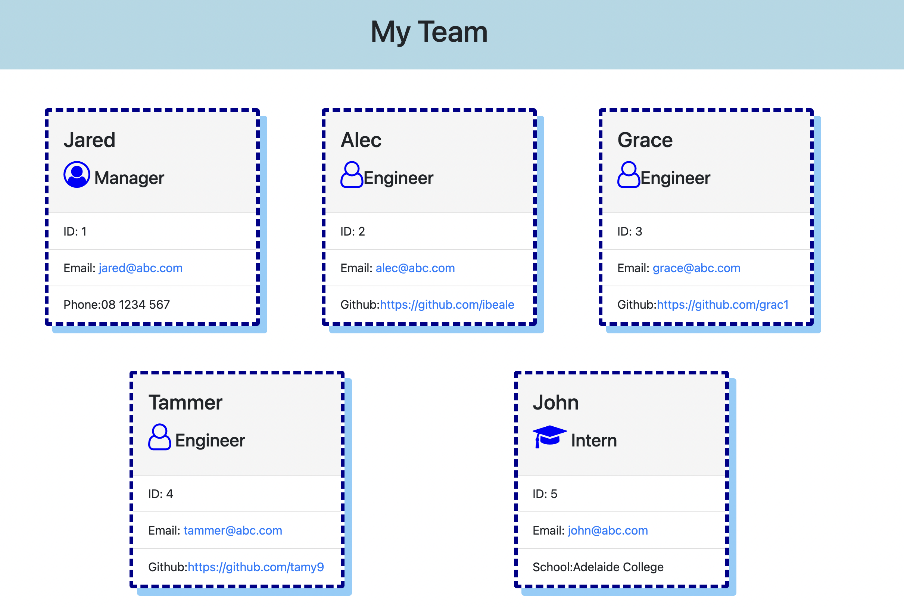

# Team Profile Generator 

## Description

The `Team Profile Generator` is a command-line application that accepts information about employees of a software engineering team, then generates an HTML webpage that displays summaries for each team member in the team.

- The program is created using `node.js`. It also utilises the `npm` packages `inquirer` and `jest`.
- HTML 5, CSS and Bootstrap to generate the HTML page.

## Table of Contents

- [Installation](#installation)
- [Usage instructions](#usage-instructions)
- [Preview of the application](#Preview-of-the-application)
- [Walkthrough and Demo](#Walkthrough-and-Demo)
- [Testing](#Testing)

## Installation

1. Clone the repo from GitHub to your local folder.
2. Run the command `npm i` to install the `npm` package `inquirer`.
3. Run the command `npm i jest` to install the `npm` package `jest`.

## Usage instructions

**To start using the Team Generator application**:

1. Run the command `node index.js` from the command prompt.
2. Enter the `Manager's` information.
3. Select the type of employee: `Engineer` or `Intern` and enter the rerquested information.
4. Select `Exit` to exit the application and generate the HTML page.
   > **Note**: The generated HTML files is saved in the ./dist/generatedHTML.html folder.

## Preview of the application

### Command-line input


### HTML File output



## Walkthrough and Demo

### Unit tests and running the application


### Accessing Email and Github from HTML Page


## Testing

As part of Test Driven Development (TDD), you will find `jest` test files in the `./test/` folder. To run these simply enter the command `npm run test` in the terminal.

```md
├── test
│ ├── employee.test.js
│ ├── engineer.test.js
│ ├── intern.test.js
│ └── manager.test.js
```
### Screenshot of test suite 

